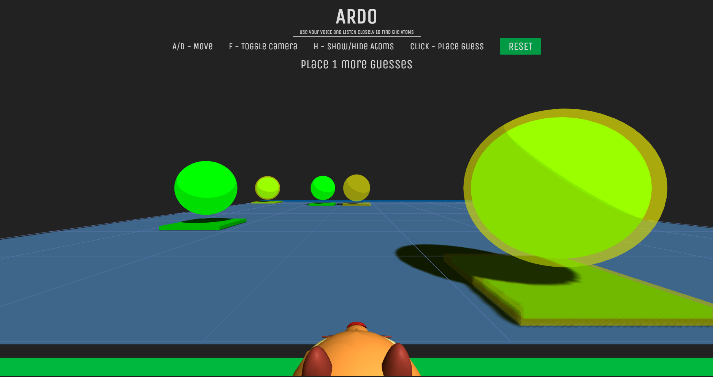

# ardo
GitHub Game Off 2020 - Moonshot

    Headphones and microphone required!

## Description
**ARDO** is an immersive, audio-based puzzle game, inspired by an old [board game from the 70s](https://en.wikipedia.org/wiki/Black_Box_(game)).

Use your voice to send off soundwaves.
Listen closely as the ghostly echoes reverberate around you.
They will let you deduce where the four charged atoms are hidden.
Mark them all to win the game.
Share your level with your friends and challenge their time.

## Rules

The behaviour of sound in **ARDO** is similar to rays in the original game.
The following images are taken from the according [Wikipedia article](https://en.wikipedia.org/wiki/Black_Box_(game)#Rules).

| Hit | Miss | Deflection | Reflection |
|:-:|:-:|:-:|:-:|
|  |  |  |  |

| Double Reflection | Detour A | Detour B | Detour C | Detour D |
|:-:|:-:|:-:|:-:|:-:|
|  |  |  |  |  |

## Hints
- Press `H` to hide the orbs after some initial practice rounds
- Every event triggers an echo, including some sound exiting the board, e.g.
  -  _Detour B_ sounds 6 echoes
  -  _Detour C_ sounds 4 echoes
  -  _Detour D_ sounds 3 echoes
- Sound is travelling at a constant speed and covers the board in one second
- Spatial audio lets the echoes sound from their actual locations, making them detectable in 3d space
- The longer a sound travels, the quieter it becomes
- The further a sound is away from your character, the more reverb it will have